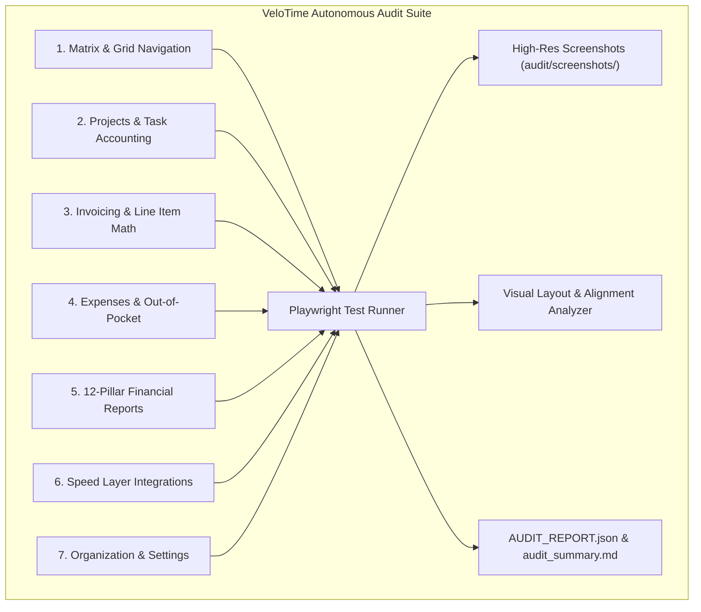

# VeloTime: Comprehensive Functionality Audit Protocol & Test Specification

This protocol provides an exhaustive feature verification checklist and autonomous test suite specification for every capability in VeloTime.

---

## 1. Feature Architecture & Audit Matrix

---

## 2. Test Specifications by Module

### Module 1: Invoicing & Billing Engine
* **Protocol ID:** `AUDIT-INV-001`
* **Test Sequence:**
  1. Navigate to `Invoices` tab.
  2. Click `+ Create Invoice`.
  3. Verify auto-generated invoice number (`INV-0001` or custom prefix).
  4. Select a project with logged unbilled hours from the project dropdown.
  5. **Auto-Population Assertion:** Verify unbilled timesheet entries automatically populate into table line items with correct hours, task names, and task rates.
  6. **Mathematical Integrity Assertion:**
     $$\text{Subtotal} = \sum(\text{Qty} \times \text{Rate})$$
     $$\text{Total Due} = \text{Subtotal} + \text{Tax} - \text{Discount} - \text{Deposit}$$
  7. **Visual Alignment Assertion:** In invoice preview and print layouts, Date Issued, Terms, Due Date, and Status right-align with zero horizontal zig-zag.
* **Pass Criteria:** Line items created, totals calculate with zero floating-point error, right alignment vertical line variance $< 1\text{px}$.

---

### Module 2: High-Velocity Matrix & Grid Navigation
* **Protocol ID:** `AUDIT-MTX-001`
* **Test Sequence:**
  1. Open `Timesheets` tab (Weekly View).
  2. Focus cell using keyboard Arrow Keys / Click.
  3. Enter numeric hours (`8.5`). Press `Tab` $\rightarrow$ next column; press `Enter` $\rightarrow$ next row.
  4. **Summation Assertion:** Column daily total and row weekly total update in real-time ($<16\text{ms}$).
  5. Add cell note via keyboard shortcut (`Alt+N` or note icon). Verify persistence.
  6. Start live stopwatch timer $\rightarrow$ verify ticking indicator $\rightarrow$ stop timer with 15m rounding applied.
* **Pass Criteria:** Keyboard navigation transitions with zero cursor trap; timer increments rounded accurately.

---

### Module 3: Projects, Tasks & Client Cost Accounting
* **Protocol ID:** `AUDIT-PRJ-001`
* **Test Sequence:**
  1. Navigate to `Projects` tab.
  2. Create new project: Name, Client, Budget ($ & hrs), Hourly Billing Rate.
  3. Add new task inline; rename existing task via inline pencil button; delete task row.
  4. Reorder project cards via drag-and-drop / chevron reordering.
* **Pass Criteria:** State updates optimistically; delete/rename buttons visible and clickable.

---

### Module 4: Expenses & Out-of-Pocket Cost Tracking
* **Protocol ID:** `AUDIT-EXP-001`
* **Test Sequence:**
  1. Navigate to `Expenses` tab.
  2. Click `Log Expense`: Input amount (`$250.00`), description, date, project link, and billable checkbox.
  3. Verify expense renders in table with formatted currency.
  4. Edit expense amount $\rightarrow$ delete expense record.
* **Pass Criteria:** Form submissions validate inputs; deleted records purge from database.

---

### Module 5: 12-Pillar Financial & Capacity Reports
* **Protocol ID:** `AUDIT-REP-001`
* **Test Sequence:**
  1. Navigate to `Reports` tab.
  2. Select `Project Profitability & Margins` report.
  3. Verify KPI summary cards: Total Hours, Gross Revenue, Loaded Labor Cost, Gross Margin (%), and Effective Hourly Rate (EHR).
  4. Test category filter pills (`Profitability`, `Capacity`, `Governance`).
  5. Trigger `Export CSV` and `Export Excel (.xlsx)` downloads.
* **Pass Criteria:** Financial math matches raw time entry multiplied by user billing/cost rates; export files contain valid binary spreadsheet data.

---

### Module 6: Front-End Speed Layer & Connected Integrations
* **Protocol ID:** `AUDIT-INT-001`
* **Test Sequence:**
  1. Click header **Plug Icon (`🔌`)** to open Integrations Hub.
  2. Test `Toggl Track` / `Harvest` / `Jira` connection cards.
  3. Click **"Verify Ping (0.1h)"** $\rightarrow$ verify dry-run verification ping dispatches and returns external Entry ID.
  4. Switch to **"Project Destination Mapping"** sub-tab $\rightarrow$ click **"Fetch Harvest/Toggl Projects"** $\rightarrow$ verify remote dropdowns populate.
  5. Test 1-click **Universal CSV Export Presets** (QuickBooks, ADP, BambooHR).
* **Pass Criteria:** External API test responses return HTTP 200/201; destination mapping states persist in local storage.

---

### Module 7: Organization Settings & Stripe Payments
* **Protocol ID:** `AUDIT-ORG-001`
* **Test Sequence:**
  1. Navigate to `Settings` tab.
  2. Edit organization name $\rightarrow$ update invoice prefix and starting number.
  3. Select timer rounding increment (0, 1m, 5m, 15m).
  4. Test Stripe Connect OAuth redirect generation.
* **Pass Criteria:** Settings persist on reload; role permissions restrict non-admin users.
